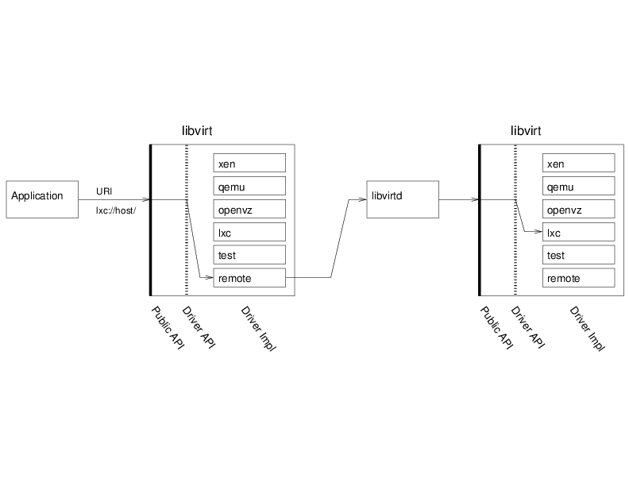

========================
The libvirt API concepts
========================

This page describes the main principles and architecture choices behind
the definition of the libvirt API:

.. contents::

Objects Exposed
---------------

As defined in the `goals section <goals.html>`__, the libvirt API is
designed to expose all the resources needed to manage the virtualization
support of recent operating systems. The first object manipulated
through the API is the ``virConnectPtr``, which represents the
connection to a hypervisor. Any application using libvirt is likely to
start using the API by calling one of `the virConnectOpen
functions <html/libvirt-libvirt-host.html#virConnectOpen>`__. You will
note that those functions take a name argument which is actually a
`connection URI <uri.html>`__ to select the right hypervisor to open. A
URI is needed to allow remote connections and also select between
different possible hypervisors. For example, on a Linux system it may be
possible to use both KVM and LinuxContainers on the same node. A NULL
name will default to a preselected hypervisor, but it's probably not a
wise thing to do in most cases. See the `connection URI <uri.html>`__
page for a full descriptions of the values allowed.

OnDevice the application obtains a
`virConnectPtr <html/libvirt-libvirt-host.html#virConnectPtr>`__
connection to the hypervisor it can then use it to manage the
hypervisor's available domains and related virtualization resources,
such as storage and networking. All those are exposed as first class
objects and connected to the hypervisor connection (and the node or
cluster where it is available).

|first class objects exposed by the API|

The figure above shows the five main objects exported by the API:

-  `virConnectPtr <html/libvirt-libvirt-host.html#virConnectPtr>`__

   Represents the connection to a hypervisor. Use one of the
   `virConnectOpen <html/libvirt-libvirt-host.html#virConnectOpen>`__
   functions to obtain connection to the hypervisor which is then used
   as a parameter to other connection API's.

-  `virDomainPtr <html/libvirt-libvirt-domain.html#virDomainPtr>`__

   Represents one domain either active or defined (i.e. existing as
   permanent config file and storage but not currently running on that
   node). The function
   `virConnectListAllDomains <html/libvirt-libvirt-domain.html#virConnectListAllDomains>`__
   lists all the domains for the hypervisor.

-  `virNetworkPtr <html/libvirt-libvirt-network.html#virNetworkPtr>`__

   Represents one network either active or defined (i.e. existing as
   permanent config file and storage but not currently activated). The
   function
   `virConnectListAllNetworks <html/libvirt-libvirt-network.html#virConnectListAllNetworks>`__
   lists all the virtualization networks for the hypervisor.

-  `virStorageVolPtr <html/libvirt-libvirt-storage.html#virStorageVolPtr>`__

   Represents one storage volume generally used as a block device
   available to one of the domains. The function
   `virStorageVolLookupByPath <html/libvirt-libvirt-storage.html#virStorageVolLookupByPath>`__
   finds the storage volume object based on its path on the node.

-  `virStoragePoolPtr <html/libvirt-libvirt-storage.html#virStoragePoolPtr>`__

   Represents a storage pool, which is a logical area used to allocate
   and store storage volumes. The function
   `virConnectListAllStoragePools <html/libvirt-libvirt-storage.html#virConnectListAllStoragePools>`__
   lists all of the virtualization storage pools on the hypervisor. The
   function
   `virStoragePoolLookupByVolume <html/libvirt-libvirt-storage.html#virStoragePoolLookupByVolume>`__
   finds the storage pool containing a given storage volume.

Most objects manipulated by the library can also be represented using
XML descriptions. This is used primarily to create those object, but is
also helpful to modify or save their description back.

Domains, networks, and storage pools can be either ``active`` i.e.
either running or available for immediate use, or ``defined`` in which
case they are inactive but there is a permanent definition available in
the system for them. Based on this they can be activated dynamically in
order to be used.

Most objects can also be named in various ways:

-  ``name``

   A user friendly identifier but whose uniqueness cannot be guaranteed
   between two nodes.

-  ``ID``

   A runtime unique identifier provided by the hypervisor for one given
   activation of the object; however, it becomes invalid once the
   resource is deactivated.

-  ``UUID``

   A 16 byte unique identifier as defined in `RFC
   4122 <https://www.ietf.org/rfc/rfc4122.txt>`__, which is guaranteed
   to be unique for long term usage and across a set of nodes.

Functions and Naming Conventions
--------------------------------

The naming of the functions present in the library is usually composed
by a prefix describing the object associated to the function and a verb
describing the action on that object.

For each first class object you will find APIs for the following
actions:

-  **Lookup** [...LookupBy...]

   Used to perform lookups on objects by some type of identifier, such
   as:

   -  `virDomainLookupByID <html/libvirt-libvirt-domain.html#virDomainLookupByID>`__
   -  `virDomainLookupByName <html/libvirt-libvirt-domain.html#virDomainLookupByName>`__
   -  `virDomainLookupByUUID <html/libvirt-libvirt-domain.html#virDomainLookupByUUID>`__
   -  `virDomainLookupByUUIDString <html/libvirt-libvirt-domain.html#virDomainLookupByUUIDString>`__

-  **Enumeration** [virConnectList..., virConnectNumOf...]

   Used to enumerate a set of object available to a given hypervisor
   connection such as:

   -  `virConnectListDomains <html/libvirt-libvirt-domain.html#virConnectListDomains>`__
   -  `virConnectNumOfDomains <html/libvirt-libvirt-domain.html#virConnectNumOfDomains>`__
   -  `virConnectListNetworks <html/libvirt-libvirt-network.html#virConnectListNetworks>`__
   -  `virConnectListStoragePools <html/libvirt-libvirt-storage.html#virConnectListStoragePools>`__

-  **Description** [...GetInfo]

   Generic accessor providing a set of generic information about an
   object, such as:

   -  `virNodeGetInfo <html/libvirt-libvirt-host.html#virNodeGetInfo>`__
   -  `virDomainGetInfo <html/libvirt-libvirt-domain.html#virDomainGetInfo>`__
   -  `virStoragePoolGetInfo <html/libvirt-libvirt-storage.html#virStoragePoolGetInfo>`__
   -  `virStorageVolGetInfo <html/libvirt-libvirt-storage.html#virStorageVolGetInfo>`__

-  **Accessors** [...Get..., ...Set...]

   Specific accessors used to query or modify data for the given object,
   such as:

   -  `virConnectGetType <html/libvirt-libvirt-host.html#virConnectGetType>`__
   -  `virDomainGetMaxMemory <html/libvirt-libvirt-domain.html#virDomainGetMaxMemory>`__
   -  `virDomainSetMemory <html/libvirt-libvirt-domain.html#virDomainSetMemory>`__
   -  `virDomainGetVcpus <html/libvirt-libvirt-domain.html#virDomainGetVcpus>`__
   -  `virStoragePoolSetAutostart <html/libvirt-libvirt-storage.html#virStoragePoolSetAutostart>`__
   -  `virNetworkGetBridgeName <html/libvirt-libvirt-network.html#virNetworkGetBridgeName>`__

-  **Creation** [...Create, ...CreateXML]

   Used to create and start objects. The ...CreateXML APIs will create
   the object based on an XML description, while the ...Create APIs will
   create the object based on existing object pointer, such as:

   -  `virDomainCreate <html/libvirt-libvirt-domain.html#virDomainCreate>`__
   -  `virDomainCreateXML <html/libvirt-libvirt-domain.html#virDomainCreateXML>`__
   -  `virNetworkCreate <html/libvirt-libvirt-network.html#virNetworkCreate>`__
   -  `virNetworkCreateXML <html/libvirt-libvirt-network.html#virNetworkCreateXML>`__

-  **Destruction** [...Destroy]

   Used to shutdown or deactivate and destroy objects, such as:

   -  `virDomainDestroy <html/libvirt-libvirt-domain.html#virDomainDestroy>`__
   -  `virNetworkDestroy <html/libvirt-libvirt-network.html#virNetworkDestroy>`__
   -  `virStoragePoolDestroy <html/libvirt-libvirt-storage.html#virStoragePoolDestroy>`__

Note: functions returning vir*Ptr (like the virDomainLookup functions)
allocate memory which needs to be freed by the caller by the
corresponding vir*Free function (e.g. virDomainFree for a virDomainPtr
object).

For more in-depth details of the storage related APIs see `the storage
management page <storage.html>`__.

The libvirt Drivers
-------------------

Drivers are the basic building block for libvirt functionality to
support the capability to handle specific hypervisor driver calls.
Drivers are discovered and registered during connection processing as
part of the
`virInitialize <html/libvirt-libvirt-host.html#virInitialize>`__
API. Each driver has a registration API which loads up the driver
specific function references for the libvirt APIs to call. The following
is a simplistic view of the hypervisor driver mechanism. Consider the
stacked list of drivers as a series of modules that can be plugged into
the architecture depending on how libvirt is configured to be built.

|The libvirt driver architecture|

The driver architecture is also used to support other virtualization
components such as storage, storage pools, host device, networking,
network interfaces, and network filters.

See the `libvirt drivers <drivers.html>`__ page for more information on
hypervisor and storage specific drivers.

Not all drivers support every virtualization function possible. The
`libvirt API support matrix <hvsupport.html>`__ lists the various
functions and support found in each driver by the version support was
added into libvirt.

Daemon and Remote Access
------------------------

Access to libvirt drivers is primarily handled by the libvirtd daemon
through the `remote <remote.html>`__ driver via an
`RPC <kbase/internals/rpc.html>`__. Some hypervisors do support client-side
connections and responses, such as Test, OpenVZ, VMware, VirtualBox
(vbox), ESX, Hyper-V, Xen, and Virtuozzo. The libvirtd daemon service is
started on the host at system boot time and can also be restarted at any
time by a properly privileged user, such as root. The libvirtd daemon
uses the same libvirt API
`virInitialize <html/libvirt-libvirt-host.html#virInitialize>`__
sequence as applications for client-side driver registrations, but then
extends the registered driver list to encompass all known drivers
supported for all driver types supported on the host.

The libvirt client `applications <apps.html>`__ use a `URI <uri.html>`__
to obtain the ``virConnectPtr``. The ``virConnectPtr`` keeps track of
the driver connection plus a variety of other connections (network,
interface, storage, etc.). The ``virConnectPtr`` is then used as a
parameter to other virtualization functions
(see `Functions and Naming Conventions`_).
Depending upon the driver being used, calls will be routed through the remote
driver to the libvirtd daemon. The daemon will reference the connection
specific driver in order to retrieve the requested information and then
pass back status and/or data through the connection back to the
application. The application can then decide what to do with that data,
such as display, write log data, etc. `Migration <migration.html>`__ is
an example of many facets of the architecture in use.

|The libvirt daemon and remote architecture|

The key takeaway from the above diagram is that there is a remote driver
which handles transactions for a majority of the drivers. The libvirtd
daemon running on the host will receive transaction requests from the
remote driver and will then query the hypervisor driver as specified in
the ``virConnectPtr`` in order to fetch the data. The data will then be
returned through the remote driver to the client application for
processing.

If you are interested in contributing to libvirt, read the
`FAQ <https://wiki.libvirt.org/page/FAQ>`__ and
`hacking <hacking.html>`__ guidelines to gain an understanding of basic
rules and guidelines. In order to add new API functionality follow the
instructions regarding `implementing a new API in
libvirt <api_extension.html>`__.

.. |first class objects exposed by the API| image:: images/libvirt-object-model.png
.. |The libvirt driver architecture| image:: images/libvirt-driver-arch.png

