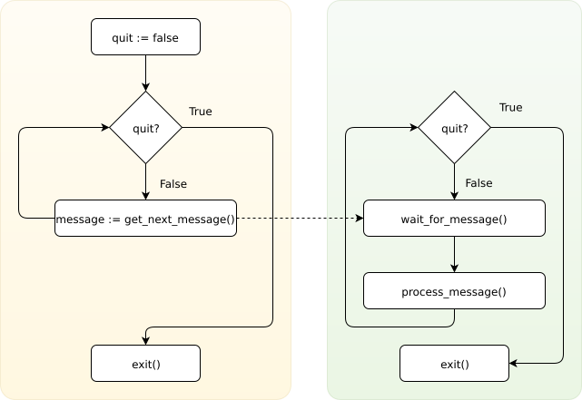

====================
Libvirt's event loop
====================

.. contents::

This page describes the event loop approach used in libvirt. Both server and
client.

Event driven programming
------------------------

Traditionally, a program simply ran once, then terminated. This type of program
was very common in the early days of computing, and lacked any form of user
interactivity. This is still used frequently, particularly in small one purpose
programs.

However, that approach is not suitable for all the types of applications. For
instance graphical applications spend most of their run time waiting for an
input from user. Only after it happened (in our example a button was clicked, a
key pressed, etc.) an event is generated to which they respond by executing
desired function. If generalized, this is how many long running programs
(daemons) work. Even those who are not waiting for direct user input and have no
graphical interface. Such as Libvirt.

.. image:: ../../images/event_loop_simple.png
   :alt: event loop

In Libvirt this approach is used in combination with ``poll(2)`` as all the
communication with its clients (and domains it manages too) happens through
sockets. Therefore whenever new client connects, it is given exclusive file
descriptor which is then watched for incoming events, e.g. messages.

The event loop API
------------------

To work with event loop from our code we have plenty of APIs.

-  ``virEventAddHandle``: Registers a callback for monitoring file handle
   events.
-  ``virEventUpdateHandle``: Change set of events monitored file handle is being
   watched for.
-  ``virEventRemoveHandle``: Unregisters previously registered file handle so
   that it is no longer monitored for any events.
-  ``virEventAddTimeout``: Registers a callback for timer event.
-  ``virEventUpdateTimeout``: Changes frequency for a timer.
-  ``virEventRemoveTimeout``: Unregisters a timer.

For more information on these APIs continue reading
`here <../../html/libvirt-libvirt-event.html>`__.

Worker pool
-----------

Looking back at the image above we can see one big limitation. While processing
a message event loop is blocked and for an outside observer unresponsive. This
is not acceptable for Libvirt. Therefore we have came up with the following
solution.

The event loop does only necessary minimum and hand over message processing to
another thread. In fact, there can be as many processing threads as configured
increasing processing power.

To break this high level description into smaller pieces, here is what happens
when user calls an API:

#. User (or management application) calls a Libvirt API. Depending on the
   connection URI, this may or may not involve server. Well, for the sake of our
   demonstration we assume the former.
#. Remote driver encodes the API among it's arguments into an `RPC
   message <rpc.html>`__ and sends it to the server.
#. Here, server is waiting in ``poll(2)`` for an event, like incoming message.
#. As soon as the first bytes of message are received, even loop wakes up and
   server starts reading the whole message.
#. Once fully read, the event loop notifies threads known as worker threads from
   which one picks the incoming message, decodes and process it.
#. As soon as API execution is finished, a reply is sent to the client.

In case that there's no free worker to process an incoming message in step 5,
message is placed at the end of a message queue and is processed in next
iteration.
