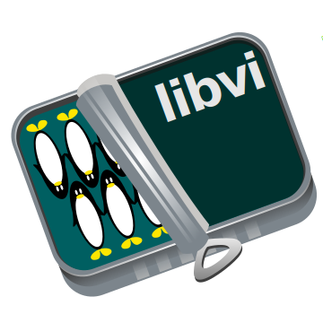
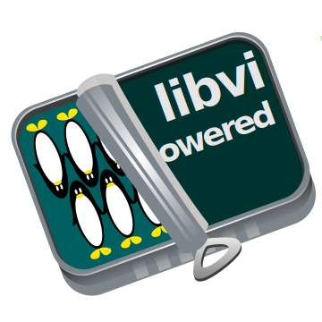
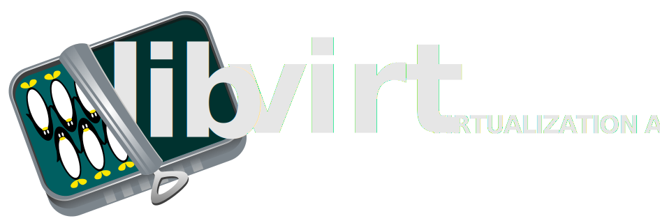
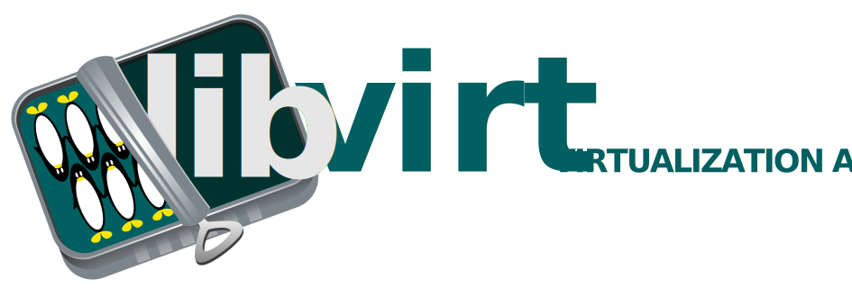
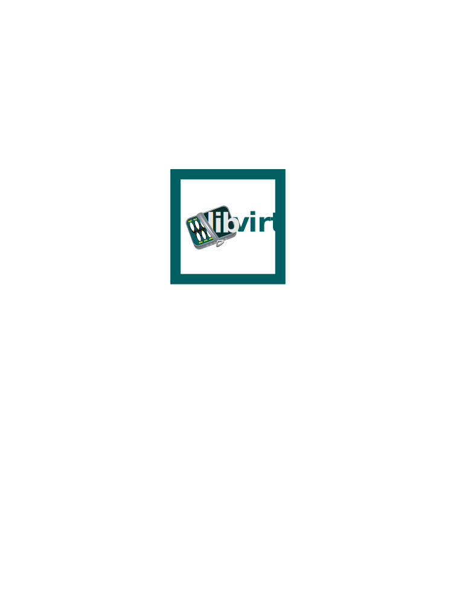
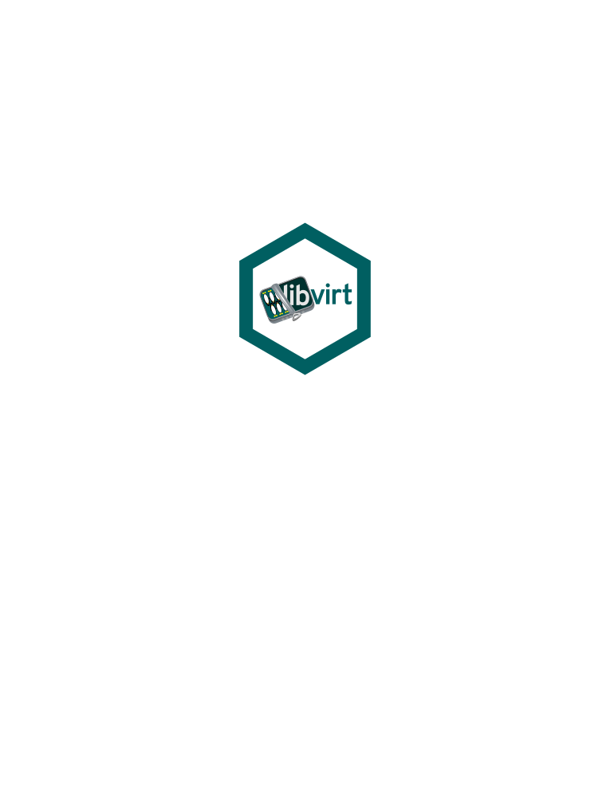

===================
Libvirt Logo README
===================

The master SVG files were created in InkScape, using the Overpass font from Red
Hat:

   https://overpassfont.org/

.. contents::

Logo formats
============

The following SVG files are provided, along with standard bitmap sizes in PNG
format:

``logo-base.svg``
-----------------

The basic "sardine tin" graphic used to create the other forms of the
libvirt logo.

The tin is rotated by 20 degrees, so its angle matches the angle of the left
side of the letter "v" in the Overpass font

Never use this logo file directly. It exists merely as a base for building
the other logos

``logo-square.svg``
-------------------

The minimal square format logo for libvirt. Simply embeds the word "libvirt"
into the basic logo graphic.

This is intended for use where a compact, square format representation of
the logo is required.

Bitmap sizes: 96, 128, 192, 256 px square

- 96px:

- 128px:

- 192px:

- 256px:

``logo-square-powered.svg``
---------------------------

A variant of the square logo for use by 3rd party applications, to advertise
their use of libvirt.

Bitmap sizes: 96, 128, 192, 256 px square

- 96px:

.. image:: logo-square-powered-96.png

- 128px:

.. image:: logo-square-powered-128.png

- 192px:

.. image:: logo-square-powered-192.png

- 256px:

.. image:: logo-square-powered-256.png

``logo-banner-light.svg``
-------------------------

A wide banner format of the logo. Embeds the words "libvirt virtualization
API" into the basic logo graphic. The text is rendered in a light color, so
suitable for placement over a dark background.

Bitmap sizes: 256x92, 800x286 px

- 256x92px:

- 800x286px:

``logo-banner-dark.svg``
------------------------

A wide banner format of the logo. Embeds the words "libvirt virtualization
API" into the basic logo graphic. The text is rendered in a dark color, so
suitable for placement over a light background.

Bitmap sizes: 256x92, 800x286 px

- 256x92px:

- 800x286px:

``logo-sticker-square.svg``
---------------------------

A logo formatted into a square shape with outline, suitable for printing
as a sticker. See https://github.com/terinjokes/StickerConstructorSpec

``logo-sticker-hexagon.svg``
----------------------------

A logo formatted into a hexagon shape with outline, suitable for printing
as a sticker. See https://github.com/terinjokes/StickerConstructorSpec

PNG file creation
=================

The bitmap images should not be created in Inkscape, since its anti-aliasing of
the rendered bitmaps is too aggressive, resulting in fuzzy images. Instead the
GIMP is used to create bitmaps as follows:

 - File -> Open, select the SVG file

   When prompted for the image size, enter 1024 as the width and allow height
   to be auto-set based on aspect ratio

 - Image -> Scale Image

   Enter desired final bitmap size and use "Cubic" as scaling method.

 - File -> Export As

It is important to let GIMP render initially at 1024 and then scale down, rather
than rendering directly at the target size, since this the manual scaling step
produces better quality
