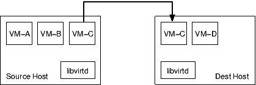
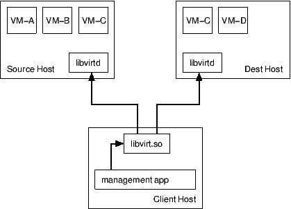
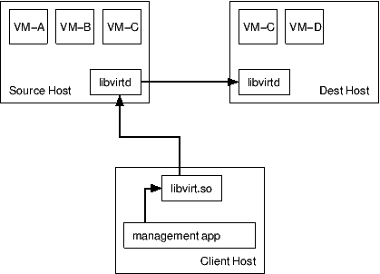
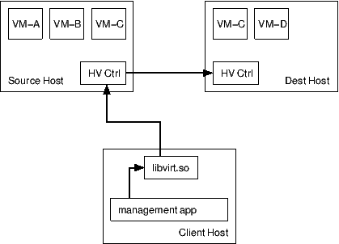

===============
Guest migration
===============

.. contents::

Migration of guests between hosts is a complicated problem with many possible
solutions, each with their own positive and negative points. For maximum
flexibility of both hypervisor integration, and administrator deployment,
libvirt implements several options for migration.

Network data transports
-----------------------

There are two options for the data transport used during migration, either the
hypervisor's own **native** transport, or **tunnelled** over a libvirtd
connection.

Hypervisor native transport
~~~~~~~~~~~~~~~~~~~~~~~~~~~

*Native* data transports may or may not support encryption, depending on the
hypervisor in question, but will typically have the lowest computational costs
by minimising the number of data copies involved. The native data transports
will also require extra hypervisor-specific network configuration steps by the
administrator when deploying a host. For some hypervisors, it might be necessary
to open up a large range of ports on the firewall to allow multiple concurrent
migration operations.

Modern hypervisors support TLS for encryption and authentication of the
migration connections which can be enabled using the ``VIR_MIGRATE_TLS`` flag.
The *qemu* hypervisor driver allows users to force use of TLS via the
``migrate_tls_force`` knob configured in ``/etc/libvirt/qemu.conf``.

|Migration native path|

libvirt tunnelled transport
~~~~~~~~~~~~~~~~~~~~~~~~~~~

*Tunnelled* data transports will always be capable of strong encryption since
they are able to leverage the capabilities built in to the libvirt RPC protocol.
The downside of a tunnelled transport, however, is that there will be extra data
copies involved on both the source and destinations hosts as the data is moved
between libvirtd and the hypervisor. This is likely to be a more significant
problem for guests with very large RAM sizes, which dirty memory pages quickly.
On the deployment side, tunnelled transports do not require any extra network
configuration over and above what's already required for general libvirtd
`remote access <remote.html>`__, and there is only need for a single port to be
open on the firewall to support multiple concurrent migration operations.

*Note:* Certain features such as migration of non-shared storage
(``VIR_MIGRATE_NON_SHARED_DISK``), the multi-connection migration
(``VIR_MIGRATE_PARALLEL``), or post-copy migration (``VIR_MIGRATE_POSTCOPY``)
may not be available when using libvirt's tunnelling.

|Migration tunnel path|

Communication control paths/flows
---------------------------------

Migration of virtual machines requires close co-ordination of the two hosts
involved, as well as the application invoking the migration, which may be on the
source, the destination, or a third host.

Managed direct migration
~~~~~~~~~~~~~~~~~~~~~~~~

With *managed direct* migration, the libvirt client process controls the various
phases of migration. The client application must be able to connect and
authenticate with the libvirtd daemons on both the source and destination hosts.
There is no need for the two libvirtd daemons to communicate with each other. If
the client application crashes, or otherwise loses its connection to libvirtd
during the migration process, an attempt will be made to abort the migration and
restart the guest CPUs on the source host. There may be scenarios where this
cannot be safely done, in which cases the guest will be left paused on one or
both of the hosts.

|Migration direct, managed|

Managed peer to peer migration
~~~~~~~~~~~~~~~~~~~~~~~~~~~~~~

With *peer to peer* migration, the libvirt client process only talks to the
libvirtd daemon on the source host. The source libvirtd daemon controls the
entire migration process itself, by directly connecting the destination host
libvirtd. If the client application crashes, or otherwise loses its connection
to libvirtd, the migration process will continue uninterrupted until completion.
Note that the source libvirtd uses its own credentials (typically root) to
connect to the destination, rather than the credentials used by the client to
connect to the source; if these differ, it is common to run into a situation
where a client can connect to the destination directly but the source cannot
make the connection to set up the peer-to-peer migration.

|Migration peer-to-peer|

Unmanaged direct migration
~~~~~~~~~~~~~~~~~~~~~~~~~~

With *unmanaged direct* migration, neither the libvirt client or libvirtd daemon
control the migration process. Control is instead delegated to the hypervisor's
over management services (if any). The libvirt client merely initiates the
migration via the hypervisor's management layer. If the libvirt client or
libvirtd crash, the migration process will continue uninterrupted until
completion.

|Migration direct, unmanaged|

Data security
-------------

Since the migration data stream includes a complete copy of the guest OS RAM,
snooping of the migration data stream may allow compromise of sensitive guest
information. If the virtualization hosts have multiple network interfaces, or if
the network switches support tagged VLANs, then it is very desirable to separate
guest network traffic from migration or management traffic.

In some scenarios, even a separate network for migration data may not offer
sufficient security. In this case it is possible to apply encryption to the
migration data stream. If the hypervisor does not itself offer encryption, then
the libvirt tunnelled migration facility should be used.

Offline migration
-----------------

Offline migration transfers the inactive definition of a domain (which may or
may not be active). After successful completion, the domain remains in its
current state on the source host and is defined but inactive on the destination
host. It's a bit more clever than ``virsh dumpxml`` on source host followed by
``virsh define`` on destination host, as offline migration will run the
pre-migration hook to update the domain XML on destination host. Currently,
copying non-shared storage or other file based storages (e.g. UEFI variable
storage) is not supported during offline migration.

Migration URIs
--------------

Initiating a guest migration requires the client application to specify up to
three URIs, depending on the choice of control flow and/or APIs used. The first
URI is that of the libvirt connection to the source host, where the virtual
guest is currently running. The second URI is that of the libvirt connection to
the destination host, where the virtual guest will be moved to (and in
peer-to-peer migrations, this is from the perspective of the source, not the
client). The third URI is a hypervisor specific URI used to control how the
guest will be migrated. With any managed migration flow, the first and second
URIs are compulsory, while the third URI is optional. With the unmanaged direct
migration mode, the first and third URIs are compulsory and the second URI is
not used.

Ordinarily management applications only need to care about the first and second
URIs, which are both in the normal libvirt connection URI format. Libvirt will
then automatically determine the hypervisor specific URI, by looking up the
target host's configured hostname. There are a few scenarios where the
management application may wish to have direct control over the third URI.

#. The configured hostname is incorrect, or DNS is broken. If a host has a
   hostname which will not resolve to match one of its public IP addresses, then
   libvirt will generate an incorrect URI. In this case the management
   application should specify the hypervisor specific URI explicitly, using an
   IP address, or a correct hostname.
#. The host has multiple network interfaces. If a host has multiple network
   interfaces, it might be desirable for the migration data stream to be sent
   over a specific interface for either security or performance reasons. In this
   case the management application should specify the hypervisor specific URI,
   using an IP address associated with the network to be used.
#. The firewall restricts what ports are available. When libvirt generates a
   migration URI it will pick a port number using hypervisor specific rules.
   Some hypervisors only require a single port to be open in the firewalls,
   while others require a whole range of port numbers. In the latter case the
   management application may wish to choose a specific port number outside the
   default range in order to comply with local firewall policies.
#. The second URI uses UNIX transport method. In this advanced case libvirt
   should not guess a \*migrateuri\* and it should be specified using UNIX
   socket path URI: ``unix:///path/to/socket``.

Configuration file handling
---------------------------

There are two types of virtual machines known to libvirt. A *transient* guest
only exists while it is running, and has no configuration file stored on disk. A
*persistent* guest maintains a configuration file on disk even when it is not
running.

By default, a migration operation will not attempt to modify any configuration
files that may be stored on either the source or destination host. It is the
administrator, or management application's, responsibility to manage
distribution of configuration files (if desired). It is important to note that
the ``/etc/libvirt`` directory **MUST NEVER BE SHARED BETWEEN HOSTS**. There are
some typical scenarios that might be applicable:

-  Centralized configuration files outside libvirt, in shared storage. A cluster
   aware management application may maintain all the master guest configuration
   files in a cluster filesystem. When attempting to start a guest, the config
   will be read from the cluster FS and used to deploy a persistent guest. For
   migration the configuration will need to be copied to the destination host
   and removed on the original.
-  Centralized configuration files outside libvirt, in a database. A data center
   management application may not store configuration files at all. Instead it
   may generate libvirt XML on the fly when a guest is booted. It will typically
   use transient guests, and thus not have to consider configuration files
   during migration.
-  Distributed configuration inside libvirt. The configuration file for each
   guest is copied to every host where the guest is able to run. Upon migration
   the existing config merely needs to be updated with any changes.
-  Ad-hoc configuration management inside libvirt. Each guest is tied to a
   specific host and rarely migrated. When migration is required, the config is
   moved from one host to the other.

As mentioned above, libvirt will not modify configuration files during migration
by default. The ``virsh`` command has two flags to influence this behaviour. The
``--undefinesource`` flag will cause the configuration file to be removed on the
source host after a successful migration. The ``--persistent`` flag will cause a
configuration file to be created on the destination host after a successful
migration. The following table summarizes the configuration file handling in all
possible state and flag combinations.

+-------------------+-------------------+-------------------+-------------------+-------------------+-------------------+-------------------+-------------------+
| Before migration                                          | Flags                                 | After migration                                           |
+-------------------+-------------------+-------------------+-------------------+-------------------+-------------------+-------------------+-------------------+
| Source type       | Source config     | Dest config       | --undefinesource  | --persistent      | Dest type         | Source config     | Dest config       |
+===================+===================+===================+===================+===================+===================+===================+===================+
| Transient         | N                 | N                 | N                 | N                 | Transient         | N                 | N                 |
+-------------------+-------------------+-------------------+-------------------+-------------------+-------------------+-------------------+-------------------+
| Transient         | N                 | N                 | Y                 | N                 | Transient         | N                 | N                 |
+-------------------+-------------------+-------------------+-------------------+-------------------+-------------------+-------------------+-------------------+
| Transient         | N                 | N                 | N                 | Y                 | Persistent        | N                 | Y                 |
+-------------------+-------------------+-------------------+-------------------+-------------------+-------------------+-------------------+-------------------+
| Transient         | N                 | N                 | Y                 | Y                 | Persistent        | N                 | Y                 |
+-------------------+-------------------+-------------------+-------------------+-------------------+-------------------+-------------------+-------------------+
| Transient         | N                 | Y                 | N                 | N                 | Persistent        | N                 | Y                 |
|                   |                   |                   |                   |                   |                   |                   | (unchanged dest   |
|                   |                   |                   |                   |                   |                   |                   | config)           |
+-------------------+-------------------+-------------------+-------------------+-------------------+-------------------+-------------------+-------------------+
| Transient         | N                 | Y                 | Y                 | N                 | Persistent        | N                 | Y                 |
|                   |                   |                   |                   |                   |                   |                   | (unchanged dest   |
|                   |                   |                   |                   |                   |                   |                   | config)           |
+-------------------+-------------------+-------------------+-------------------+-------------------+-------------------+-------------------+-------------------+
| Transient         | N                 | Y                 | N                 | Y                 | Persistent        | N                 | Y                 |
|                   |                   |                   |                   |                   |                   |                   | (replaced with    |
|                   |                   |                   |                   |                   |                   |                   | source)           |
+-------------------+-------------------+-------------------+-------------------+-------------------+-------------------+-------------------+-------------------+
| Transient         | N                 | Y                 | Y                 | Y                 | Persistent        | N                 | Y                 |
|                   |                   |                   |                   |                   |                   |                   | (replaced with    |
|                   |                   |                   |                   |                   |                   |                   | source)           |
+-------------------+-------------------+-------------------+-------------------+-------------------+-------------------+-------------------+-------------------+
| Persistent        | Y                 | N                 | N                 | N                 | Transient         | Y                 | N                 |
+-------------------+-------------------+-------------------+-------------------+-------------------+-------------------+-------------------+-------------------+
| Persistent        | Y                 | N                 | Y                 | N                 | Transient         | N                 | N                 |
+-------------------+-------------------+-------------------+-------------------+-------------------+-------------------+-------------------+-------------------+
| Persistent        | Y                 | N                 | N                 | Y                 | Persistent        | Y                 | Y                 |
+-------------------+-------------------+-------------------+-------------------+-------------------+-------------------+-------------------+-------------------+
| Persistent        | Y                 | N                 | Y                 | Y                 | Persistent        | N                 | Y                 |
+-------------------+-------------------+-------------------+-------------------+-------------------+-------------------+-------------------+-------------------+
| Persistent        | Y                 | Y                 | N                 | N                 | Persistent        | Y                 | Y                 |
|                   |                   |                   |                   |                   |                   |                   | (unchanged dest   |
|                   |                   |                   |                   |                   |                   |                   | config)           |
+-------------------+-------------------+-------------------+-------------------+-------------------+-------------------+-------------------+-------------------+
| Persistent        | Y                 | Y                 | Y                 | N                 | Persistent        | N                 | Y                 |
|                   |                   |                   |                   |                   |                   |                   | (unchanged dest   |
|                   |                   |                   |                   |                   |                   |                   | config)           |
+-------------------+-------------------+-------------------+-------------------+-------------------+-------------------+-------------------+-------------------+
| Persistent        | Y                 | Y                 | N                 | Y                 | Persistent        | Y                 | Y                 |
|                   |                   |                   |                   |                   |                   |                   | (replaced with    |
|                   |                   |                   |                   |                   |                   |                   | source)           |
+-------------------+-------------------+-------------------+-------------------+-------------------+-------------------+-------------------+-------------------+
| Persistent        | Y                 | Y                 | Y                 | Y                 | Persistent        | N                 | Y                 |
|                   |                   |                   |                   |                   |                   |                   | (replaced with    |
|                   |                   |                   |                   |                   |                   |                   | source)           |
+-------------------+-------------------+-------------------+-------------------+-------------------+-------------------+-------------------+-------------------+

Migration scenarios
-------------------

Native migration, client to two libvirtd servers
~~~~~~~~~~~~~~~~~~~~~~~~~~~~~~~~~~~~~~~~~~~~~~~~

At an API level this requires use of virDomainMigrate, without the
VIR_MIGRATE_PEER2PEER flag set. The destination libvirtd server will
automatically determine the native hypervisor URI for migration based off the
primary hostname. To force migration over an alternate network interface the
optional hypervisor specific URI must be provided

::

   syntax: virsh migrate GUESTNAME DEST-LIBVIRT-URI [HV-URI]

   eg using default network interface

   virsh migrate web1 qemu+ssh://desthost/system
   virsh migrate web1 xen+tls://desthost/system

   eg using secondary network interface

   virsh migrate web1 qemu://desthost/system tcp://10.0.0.1/

Supported by Xen, QEMU, VMware and VirtualBox drivers

Native migration, client to and peer2peer between, two libvirtd servers
~~~~~~~~~~~~~~~~~~~~~~~~~~~~~~~~~~~~~~~~~~~~~~~~~~~~~~~~~~~~~~~~~~~~~~~

virDomainMigrate, with the VIR_MIGRATE_PEER2PEER flag set, using the libvirt URI
format for the 'uri' parameter. The destination libvirtd server will
automatically determine the native hypervisor URI for migration, based off the
primary hostname. The optional uri parameter controls how the source libvirtd
connects to the destination libvirtd, in case it is not accessible using the
same address that the client uses to connect to the destination, or a different
encryption/auth scheme is required. There is no scope for forcing an alternative
network interface for the native migration data with this method.

This mode cannot be invoked from virsh

Supported by QEMU driver

Tunnelled migration, client and peer2peer between two libvirtd servers
~~~~~~~~~~~~~~~~~~~~~~~~~~~~~~~~~~~~~~~~~~~~~~~~~~~~~~~~~~~~~~~~~~~~~~

virDomainMigrate, with the VIR_MIGRATE_PEER2PEER & VIR_MIGRATE_TUNNELLED flags
set, using the libvirt URI format for the 'uri' parameter. The destination
libvirtd server will automatically determine the native hypervisor URI for
migration, based off the primary hostname. The optional uri parameter controls
how the source libvirtd connects to the destination libvirtd, in case it is not
accessible using the same address that the client uses to connect to the
destination, or a different encryption/auth scheme is required. The native
hypervisor URI format is not used at all.

This mode cannot be invoked from virsh

Supported by QEMU driver

Native migration, client to one libvirtd server
~~~~~~~~~~~~~~~~~~~~~~~~~~~~~~~~~~~~~~~~~~~~~~~

virDomainMigrateToURI, without the VIR_MIGRATE_PEER2PEER flag set, using a
hypervisor specific URI format for the 'uri' parameter. There is no use or
requirement for a destination libvirtd instance at all. This is typically used
when the hypervisor has its own native management daemon available to handle
incoming migration attempts on the destination.

::

   syntax: virsh migrate GUESTNAME HV-URI

   eg using same libvirt URI for all connections

Native migration, peer2peer between two libvirtd servers
~~~~~~~~~~~~~~~~~~~~~~~~~~~~~~~~~~~~~~~~~~~~~~~~~~~~~~~~

virDomainMigrateToURI, with the VIR_MIGRATE_PEER2PEER flag set, using the
libvirt URI format for the 'uri' parameter. The destination libvirtd server will
automatically determine the native hypervisor URI for migration, based off the
primary hostname. There is no scope for forcing an alternative network interface
for the native migration data with this method. The destination URI must be
reachable using the source libvirtd credentials (which are not necessarily the
same as the credentials of the client in connecting to the source).

::

   syntax: virsh migrate GUESTNAME DEST-LIBVIRT-URI [ALT-DEST-LIBVIRT-URI]

   eg using same libvirt URI for all connections

   virsh migrate --p2p web1 qemu+ssh://desthost/system

   eg using different libvirt URI auth scheme for peer2peer connections

   virsh migrate --p2p web1 qemu+ssh://desthost/system qemu+tls:/desthost/system

   eg using different libvirt URI hostname for peer2peer connections

   virsh migrate --p2p web1 qemu+ssh://desthost/system qemu+ssh://10.0.0.1/system

Supported by the QEMU driver

Tunnelled migration, peer2peer between two libvirtd servers
~~~~~~~~~~~~~~~~~~~~~~~~~~~~~~~~~~~~~~~~~~~~~~~~~~~~~~~~~~~

virDomainMigrateToURI, with the VIR_MIGRATE_PEER2PEER & VIR_MIGRATE_TUNNELLED
flags set, using the libvirt URI format for the 'uri' parameter. The destination
libvirtd server will automatically determine the native hypervisor URI for
migration, based off the primary hostname. The optional uri parameter controls
how the source libvirtd connects to the destination libvirtd, in case it is not
accessible using the same address that the client uses to connect to the
destination, or a different encryption/auth scheme is required. The native
hypervisor URI format is not used at all. The destination URI must be reachable
using the source libvirtd credentials (which are not necessarily the same as the
credentials of the client in connecting to the source).

::

   syntax: virsh migrate GUESTNAME DEST-LIBVIRT-URI [ALT-DEST-LIBVIRT-URI]

   eg using same libvirt URI for all connections

   virsh migrate --p2p --tunnelled web1 qemu+ssh://desthost/system

   eg using different libvirt URI auth scheme for peer2peer connections

   virsh migrate --p2p --tunnelled web1 qemu+ssh://desthost/system qemu+tls:/desthost/system

   eg using different libvirt URI hostname for peer2peer connections

   virsh migrate --p2p --tunnelled web1 qemu+ssh://desthost/system qemu+ssh://10.0.0.1/system

Supported by QEMU driver

Migration using only UNIX sockets
~~~~~~~~~~~~~~~~~~~~~~~~~~~~~~~~~

In niche scenarios where libvirt daemon does not have access to the network
(e.g. running in a restricted container on a host that has accessible network),
when a management application wants to have complete control over the transfer
or when migrating between two containers on the same host all the communication
can be done using UNIX sockets. This includes connecting to non-standard socket
path for the destination daemon, using UNIX sockets for hypervisor's
communication or for the NBD data transfer. All of that can be used with both
peer2peer and direct migration options.

Example using ``/tmp/migdir`` as a directory representing the same path visible
from both libvirt daemons. That can be achieved by bind-mounting the same
directory to different containers running separate daemons or forwarding
connections to these sockets manually (using ``socat``, ``netcat`` or a custom
piece of software):

::

   virsh migrate --domain web1 [--p2p] --copy-storage-all
     --desturi 'qemu+unix:///system?socket=/tmp/migdir/test-sock-driver'
     --migrateuri 'unix:///tmp/migdir/test-sock-qemu'
     --disks-uri unix:///tmp/migdir/test-sock-nbd

One caveat is that on SELinux-enabled systems all the sockets that the
hypervisor is going to connect to needs to have the proper context and that is
chosen before its creation by the process that creates it. That is usually done
by using ``setsockcreatecon{,raw}()`` functions. Generally
\*system_r:system_u:svirt_socket_t:s0\* should do the trick, but check the
SELinux rules and settings of your system.

Supported by QEMU driver

Migration of VMs using non-shared images for disks
~~~~~~~~~~~~~~~~~~~~~~~~~~~~~~~~~~~~~~~~~~~~~~~~~~

Libvirt by default expects that the disk images which are not explicitly network
accessed are shared between the hosts by means of a network filesystem or remote
block storage.

By default it's expected that they are in the same location, but this can be
modified by providing an updated domain XML with appropriate paths to the images
using ``--xml`` argument for ``virsh migrate``.

In case when one or more of the images are residing on local storage libvirt
can migrate them as part of the migration flow. This is enabled using
``--copy-storage-all`` flag for ``virsh migrate``. Additionally
``--migrate-disks`` parameter allows control which disks need to actually be
migrated. Without the flag all read-write disks are migrated.

On the destination the images must be either pre-created by the user having
correct format and size or alternatively if the target path resides within a
libvirt storage pool they will be automatically created.

In case when the user wishes to migrate only the topmost image from a backing
chain of images for each disks ``--copy-storage-inc`` can be used instead. User
must pre-create the images unconditionally.

In order to ensure that the migration of disks will not be overwhelmed by a
guest doing a lot of I/O to a local fast storage the
``--copy-storage-synchronous-writes`` flag ensures that newly written data is
synchronously written to the destination. This may harm I/O performance during
the migration.

.. |Migration tunnel path| image:: images/migration-tunnel.png
   :class: diagram

